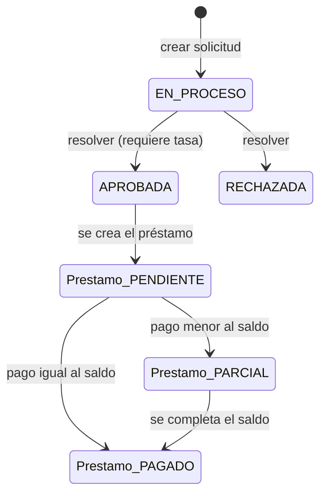

# Arquitectura

## Visión general

El sistema tiene dos aplicaciones y una base de datos:

```
┌────────────────────┐        HTTP/JSON        ┌────────────────────┐
│  Frontend (Angular) │  ───────────────────▶  │  Backend (Spring)   │
│  http://localhost:4200                        │  http://localhost:8080
└────────────────────┘   /api/...              └─────────┬──────────┘
                                                          │ JDBC
                                                          ▼
                                                ┌────────────────────┐
                                                │  SQL Server 2022    │
                                                │  localhost:1433     │
                                                └────────────────────┘
```

- **Frontend:** interfaz de usuario. Llama a la API con rutas relativas (`/api`).
- **Backend:** expone la API REST y aplica las reglas de negocio.
- **Base de datos:** guarda los datos. El esquema lo genera Hibernate.

## Estructura del repositorio

```
sistema-prestamos-chn/
├─ backend/prestamos-api/   # API REST (Spring Boot)
├─ frontend/                # Aplicación Angular
├─ docs/                    # Esta documentación
├─ docker-compose.yml       # Orquestación de los 3 contenedores
├─ .env.example             # Plantilla de variables de entorno
└─ README.md                # Instalación y arranque
```

## Backend

### Capas

El código está en `src/main/java/com/chn/prestamos/` y se organiza por capas:

| Paquete | Responsabilidad |
|---------|-----------------|
| `controller` | Recibe las peticiones HTTP y devuelve las respuestas. |
| `service` | Reglas de negocio y transacciones. |
| `repository` | Acceso a datos (Spring Data JPA). |
| `entity` | Clases que representan las tablas. |
| `dto` | Objetos de entrada para crear/resolver. |
| `config` | Datos de prueba (`DataSeeder`). |
| `exception` | Manejo global de errores. |

Flujo de una petición:

```
Cliente HTTP → Controller → Service → Repository → Base de datos
                    ▲                        │
                    └──────── Entity/DTO ─────┘
```

- Los `controller` solo orquestan; **toda la lógica vive en `service`**.
- Los `service` están anotados con `@Transactional`.
- Las entidades se devuelven directamente en las respuestas (no hay DTOs de salida).
- Los DTOs (`dto/`) son `record` y solo existen para las peticiones de crear/resolver.

### Validación y errores

- Las validaciones se declaran con anotaciones (`@NotNull`, `@Size`, `@Pattern`, etc.)
  en entidades y DTOs, y se activan con `@Valid` en los controladores.
- `GlobalExceptionHandler` (`@RestControllerAdvice`) centraliza los errores:

| Situación | Código | Cuerpo |
|-----------|:------:|--------|
| Datos inválidos | `400` | `{ "mensaje": "...", "errores": { "campo": "detalle" } }` |
| JSON mal formado | `400` | `{ "mensaje": "..." }` |
| Recurso no encontrado | `404` | `{ "mensaje": "..." }` |
| Conflicto (regla de negocio o BD) | `409` | `{ "mensaje": "..." }` |

Los errores de negocio se lanzan como `ResponseStatusException` (sin excepciones
personalizadas) y `GlobalExceptionHandler` los convierte al formato
`{ "mensaje": "..." }`.

### Modelo de dominio

Cuatro entidades (todas extienden `BaseEntity`, que aporta `creado_en`/`actualizado_en`):

- **Cliente** — datos personales.
- **SolicitudPrestamo** — petición de crédito. Estado: `EN_PROCESO`, `APROBADA`, `RECHAZADA`.
- **Prestamo** — crédito aprobado. Estado: `PENDIENTE`, `PARCIAL`, `PAGADO`.
  `cliente`, `saldoPendiente` y `estado` son **derivados** (no se almacenan): el cliente
  se obtiene vía `solicitud` y el saldo/estado a partir de `montoAprobado`/`montoPagado`.
- **Pago** — abono a un préstamo.

### Flujo de negocio



Reglas clave:

- Una solicitud **solo se puede resolver una vez**.
- Al **aprobar** se exige `tasaInteresAnual` y se crea el préstamo con
  `montoPagado = 0`. El saldo y el estado se derivan (al inicio, `PENDIENTE`).
- Al **rechazar** no se crea préstamo.
- Un pago **no puede superar** el saldo pendiente; al registrarlo se incrementa
  `montoPagado` y, a partir de él, el saldo y el estado pasan a `PARCIAL` o `PAGADO`.
  Un `numeroRecibo` repetido devuelve `409`.

### Base de datos

- El esquema lo genera Hibernate (`ddl-auto=update`); ver [base-de-datos.md](base-de-datos.md).
- Modelo normalizado (1FN–3FN/BCNF): `prestamos` no guarda `cliente_id`,
  `saldo_pendiente` ni `estado` (se derivan). La única denormalización intencional es
  `prestamos.monto_pagado` (caché del total pagado).
- Integridad: claves foráneas, restricciones `CHECK` para los estados y el método de pago,
  e índice único filtrado para `pagos.numero_recibo`.
- Auditoría: las 4 tablas tienen `creado_en` y `actualizado_en` (`BaseEntity`).

## Frontend

Aplicación Angular con componentes **standalone** y rutas en `app.routes.ts`:

| Ruta | Pantalla |
|------|----------|
| `/dashboard` | Panel general con totales |
| `/clientes` | Gestión de clientes |
| `/solicitudes` | Solicitudes y aprobación/rechazo |
| `/prestamos` | Préstamos y saldos |
| `/pagos` | Registro de pagos |

- Cada pantalla tiene su `.ts`, `.html` y `.scss`.
- Los formularios usan **Reactive Forms** (`FormBuilder`, `inject()`).
- Los selects con búsqueda usan **`@ng-select/ng-select`**.
- Las tablas se renderizan con getters filtrados (`pagosFiltrados`, `solicitudesFiltradas`,
  `prestamosFiltrados`).
- Los servicios (`services/`) hacen las llamadas HTTP con `HttpClient`.
- La URL base es relativa (`/api`): en desarrollo el `proxy.conf.json` la reenvía al
  backend, y en Docker lo hace nginx.
- El proyecto usa **zone.js**, por eso algunas cargas asíncronas llaman manualmente a
  `ChangeDetectorRef.detectChanges()`.

## Configuración

`backend/prestamos-api/src/main/resources/application.properties`:

| Propiedad | Valor por defecto | Descripción |
|-----------|-------------------|-------------|
| `spring.datasource.url` | `jdbc:sqlserver://localhost:1433;databaseName=prestamos_db...` | Conexión a la base. Se puede sobreescribir con `DB_URL`. |
| `spring.datasource.username` | `sa` | Usuario (`DB_USERNAME`). |
| `spring.datasource.password` | *(sin valor)* | Contraseña (`DB_PASSWORD`). |
| `spring.jpa.hibernate.ddl-auto` | `update` | Crea/actualiza tablas automáticamente. |
| `app.seed.enabled` | `false` | Carga datos demo (`APP_SEED_ENABLED`). |
| `springdoc.*` | — | Configuración de Swagger UI. |

## Despliegue (Docker Compose)

`docker compose up --build` levanta **3 contenedores**:

1. **`sqlserver`** — SQL Server 2022. Crea la base `prestamos_db` en el primer arranque
   (variable `MSSQL_DB`) y solo queda saludable cuando la base existe.
2. **`backend`** — la API. Arranca cuando SQL Server está saludable y crea las tablas
   con Hibernate. Si `APP_SEED_ENABLED=true`, carga los datos demo.
3. **`frontend`** — nginx que sirve la aplicación Angular y hace de proxy de `/api`
   hacia el backend.

No hay migraciones: el esquema lo genera Hibernate. En `docs/sql/esquema.sql` está el
script equivalente para referencia.

**Swagger UI:** el backend lo expone directo en
`http://localhost:8080/swagger-ui/index.html`, y nginx lo publica además en
`http://localhost:4200/swagger-ui/index.html` (útil si el `8080` está ocupado en IPv4
por otro proceso).

## Pruebas

- **Backend:** pruebas unitarias con Mockito (no necesitan base de datos):
  `ClienteServiceTest`, `SolicitudPrestamoServiceTest`, `PagoServiceTest`.
- **Frontend:** pruebas con Vitest.
