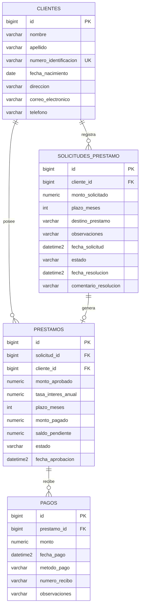

# Base de datos

Motor: **SQL Server 2022**. Base de datos: **`prestamos_db`**.

> El esquema lo crea y actualiza **Hibernate** automáticamente
> (`spring.jpa.hibernate.ddl-auto=update`); no hay migraciones. El script
> [`sql/esquema.sql`](sql/esquema.sql) es el equivalente en SQL para referencia
> o para crear la base manualmente.

## Diagrama entidad-relación



Relaciones:

- Un **cliente** tiene muchas **solicitudes**.
- Un **cliente** tiene muchos **préstamos**.
- Una **solicitud** genera **como máximo un préstamo** (relación 1 a 1).
- Un **préstamo** recibe muchos **pagos**.

## Diccionario de datos

### `clientes`

| Columna | Tipo | Nulo | Descripción |
|---------|------|:----:|-------------|
| `id` | `BIGINT IDENTITY` | No | Clave primaria. |
| `nombre` | `VARCHAR(100)` | No | Nombre del cliente. |
| `apellido` | `VARCHAR(100)` | No | Apellido del cliente. |
| `numero_identificacion` | `VARCHAR(25)` | No | Identificación, **única**. |
| `fecha_nacimiento` | `DATE` | No | Fecha de nacimiento. |
| `direccion` | `VARCHAR(250)` | No | Dirección. |
| `correo_electronico` | `VARCHAR(150)` | No | Correo electrónico. |
| `telefono` | `VARCHAR(20)` | No | Teléfono. |

### `solicitudes_prestamo`

| Columna | Tipo | Nulo | Descripción |
|---------|------|:----:|-------------|
| `id` | `BIGINT IDENTITY` | No | Clave primaria. |
| `cliente_id` | `BIGINT` | No | FK → `clientes.id`. |
| `monto_solicitado` | `NUMERIC(18,2)` | No | Monto pedido. |
| `plazo_meses` | `INT` | No | Plazo en meses (1–360). |
| `destino_prestamo` | `VARCHAR(200)` | No | Motivo del préstamo. |
| `observaciones` | `VARCHAR(500)` | Sí | Notas adicionales. |
| `fecha_solicitud` | `DATETIME2` | No | Fecha de creación. |
| `estado` | `VARCHAR(20)` | No | `EN_PROCESO`, `APROBADA`, `RECHAZADA`. |
| `fecha_resolucion` | `DATETIME2` | Sí | Fecha de aprobación/rechazo. |
| `comentario_resolucion` | `VARCHAR(500)` | Sí | Comentario de la resolución. |

### `prestamos`

| Columna | Tipo | Nulo | Descripción |
|---------|------|:----:|-------------|
| `id` | `BIGINT IDENTITY` | No | Clave primaria. |
| `solicitud_id` | `BIGINT` | No | FK → `solicitudes_prestamo.id`, **única**. |
| `cliente_id` | `BIGINT` | No | FK → `clientes.id`. |
| `monto_aprobado` | `NUMERIC(18,2)` | No | Monto aprobado. |
| `tasa_interes_anual` | `NUMERIC(5,2)` | No | Tasa anual (%). |
| `plazo_meses` | `INT` | No | Plazo en meses. |
| `monto_pagado` | `NUMERIC(18,2)` | No | Total pagado (inicia en 0). |
| `saldo_pendiente` | `NUMERIC(18,2)` | No | Saldo por pagar. |
| `estado` | `VARCHAR(20)` | No | `PENDIENTE`, `PARCIAL`, `PAGADO`. |
| `fecha_aprobacion` | `DATETIME2` | No | Fecha de aprobación. |

### `pagos`

| Columna | Tipo | Nulo | Descripción |
|---------|------|:----:|-------------|
| `id` | `BIGINT IDENTITY` | No | Clave primaria. |
| `prestamo_id` | `BIGINT` | No | FK → `prestamos.id`. |
| `monto` | `NUMERIC(18,2)` | No | Monto del pago. |
| `fecha_pago` | `DATETIME2` | No | Fecha del pago. |
| `metodo_pago` | `VARCHAR(20)` | No | Método (`EFECTIVO`). |
| `numero_recibo` | `VARCHAR(50)` | Sí | Número de recibo. |
| `observaciones` | `VARCHAR(250)` | Sí | Notas adicionales. |

## Restricciones

| Tabla | Restricción | Columnas |
|-------|-------------|----------|
| `clientes` | Clave primaria | `id` |
| `clientes` | Única | `numero_identificacion` |
| `solicitudes_prestamo` | Clave primaria | `id` |
| `solicitudes_prestamo` | Clave foránea | `cliente_id` → `clientes.id` |
| `prestamos` | Clave primaria | `id` |
| `prestamos` | Única | `solicitud_id` |
| `prestamos` | Clave foránea | `solicitud_id` → `solicitudes_prestamo.id` |
| `prestamos` | Clave foránea | `cliente_id` → `clientes.id` |
| `pagos` | Clave primaria | `id` |
| `pagos` | Clave foránea | `prestamo_id` → `prestamos.id` |

> El script `sql/esquema.sql` usa nombres legibles (`PK_clientes`, `FK_pago_prestamo`,
> etc.). Hibernate crea las mismas restricciones pero con nombres generados
> aleatoriamente (por ejemplo `FK1p1oxv8lw7yvvyrv9bukcja7s` para
> `pagos.prestamo_id`). Las columnas, tipos y relaciones son idénticos.

## Cómo se crea y se puebla

1. **Creación de la base:** el contenedor `sqlserver` la crea en el primer arranque
   gracias a la variable `MSSQL_DB=prestamos_db` (solo si el volumen está vacío).
2. **Creación de tablas:** las genera Hibernate al arrancar el backend
   (`ddl-auto=update`).
3. **Datos de prueba:** si `APP_SEED_ENABLED=true` (activado en Docker Compose), el
   `DataSeeder` carga 12 clientes, 24 solicitudes, 12 préstamos y 10 pagos. Es
   idempotente: si ya hay clientes, no hace nada.

Para empezar de cero (borra la base y vuelve a crearla):

```bash
docker compose down -v && docker compose up --build
```
